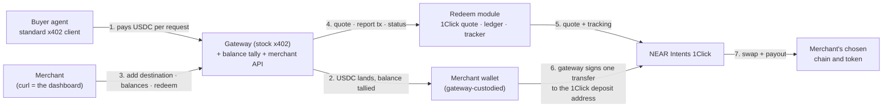

# 1CS Redeem Demo

Demo of a "redeem to any chain" payout feature for x402 payment gateways. Buyers pay stablecoins over standard x402 into the merchant's wallet on the payment network, exactly as such gateways work today; the merchant then redeems the accumulated balance to any chain and token supported by the NEAR Intents [1Click Swap API](https://docs.near-intents.org/) with a single API call. **The merchant's accumulation wallet on the payment network is assumed to be controlled by the gateway service (custodial):** the gateway quotes, signs the outbound transfer and tracks delivery, so the merchant never builds or signs a transaction. The repo contains a stand-in x402 gateway (stock middleware, a balance tally and the merchant REST API), a buyer script, and the redeem module (1Click quotes, swap tracking, ledger). Mainnet only, cent-sized amounts.

## How it works



Two processes (`gateway` on :4021, `module` on :4022, or both at once with `npm run demo`) and one script (`buy`). The merchant needs nothing installed: the dashboard is the gateway's `/merchant/*` REST API, driven here with `curl`. Everything 1Click-specific lives in the module.

## Components

**Stand-ins, only for the demo** (they exist in the real world already, or would be built by the gateway operator):

| Component | File | Stands in for |
|---|---|---|
| Buyer agent | `scripts/buyer.ts` | Any x402-paying client or AI agent; a stock `@x402/fetch` client with a funded wallet. |
| Gateway | `src/gateway.ts` | The operator's x402 gateway: stock middleware plus the Coinbase facilitator, paying into the merchant wallet exactly as today. |
| Balance tally | `src/gateway.ts` → `balances.json` | The gateway's own settlement bookkeeping: adds each settled payment, subtracts each redeem. |
| Merchant API | `src/gateway.ts` → `/merchant/*` | The dashboard's Redeem screen as REST: balances, destinations, preview / redeem, history. Driven with `curl` here; a UI in production. |
| Custody signer | `src/gateway.ts` | The gateway holds the merchant wallet's key and signs the redeem transfer. In production this is the operator's custody signer (or wallet-connect if merchants keep their own wallets). |

**New for this service** (what would ship to production, in some form):

| Component | File | What it does |
|---|---|---|
| Redeem module | `src/module.ts`, `src/redeem.ts` | The HTTP service the gateway's dashboard backend calls: preview and confirm a redeem (1Click quotes), take the merchant's tx hash, track the swap to delivery. |
| Ledger | `src/ledger.ts` | One record per redeem, from instructions to delivery or refund; a JSON file here, a database table in production. |
| Network table | `src/networks.ts` | The payment networks a merchant can redeem from, their USDC contracts and 1Click asset ids. |
| Destination catalog and saved destinations | `src/destinations.ts` → `destinations.json` | Which chains and tokens a merchant can be paid out to (near, tron, ethereum, bitcoin, zcash, solana; native token plus USDC/USDT where 1Click lists them), address format checks, and the merchant's saved `{alias, chain, token, account}` list. |
| Dashboard and API changes | sketched by `/merchant/*` | The operator's side: a Redeem screen and public-API endpoints over the module calls, the custody signer, and balance decrement/restore on confirm, expiry and refund. |

**Why two processes.** In production the redeem module is one component of the gateway operator's stack, called by their dashboard backend. The demo keeps it as a separate process on its own port so the ownership line is visible: the gateway terminal shows the operator's side, the module terminal shows the part we supply, and the five HTTP calls between them are exactly the integration contract. For a quick run, `npm run demo` starts both in a single terminal with `[gateway]` and `[module ]` prefixed log lines; nothing else changes, the two still talk over localhost and each reaches the facilitator and 1Click on its own.

## Before you start

Everything below is needed only once. Fill the values into `.env` (copy `.env.example`).

| What | Where | Notes |
|---|---|---|
| Coinbase Developer Platform **Secret** API key | portal.cdp.coinbase.com → API keys → Secret | Facilitator verify/settle on mainnet. Free tier: 1,000 settlements/month. |
| 1Click partner JWT (optional) | partners.near-intents.org | Removes the 0.2 % fee on quotes. Everything works without it. |
| Buyer wallet | fresh EOA | ~3 USDC on each network below. No gas needed. |
| Merchant wallet | fresh EOA, key held by the gateway | A few cents of gas per network (ETH on Base and Arbitrum, POL on Polygon). No USDC; it receives the payments and the gateway signs redeems from it. |
| Seller destination | a NEAR account (and optionally a Tron address) | Where redeems are delivered; default via `REDEEM_RECIPIENT`. |

Native USDC contracts for funding the buyer (not the bridged `USDC.e` variants):

| Network | USDC |
|---|---|
| Base `eip155:8453` | `0x833589fCD6eDb6E08f4c7C32D4f71b54bdA02913` |
| Polygon `eip155:137` | `0x3c499c542cEF5E3811e1192ce70d8cC03d5c3359` |
| Arbitrum `eip155:42161` | `0xaf88d065e77c8cC2239327C5EDb3A432268e5831` |

Then:

```bash
npm install
cp .env.example .env
npm run demo         # terminal 1: gateway (:4021) + module (:4022) together; or `npm run gateway` and `npm run module` in two terminals
npm run buy -- --network eip155:42161 --times 3    # terminal 2: a buyer pays three times
```

The merchant then uses the gateway's API, nothing to install:

```bash
curl -s localhost:4021/merchant/balances
curl -s localhost:4021/merchant/destinations          # saved payout destinations (REDEEM_RECIPIENT seeds "near-usdc")
curl -s -X POST localhost:4021/merchant/destinations -H 'content-type: application/json' -d '{"chain":"solana","token":"USDC","account":"<your Solana address>"}'
curl -s -X POST localhost:4021/merchant/redeem -H 'content-type: application/json' -d '{"originNetwork":"eip155:42161","to":"solana-usdc","dry":true}'
curl -s -X POST localhost:4021/merchant/redeem -H 'content-type: application/json' -d '{"originNetwork":"eip155:42161","to":"solana-usdc"}'
curl -s localhost:4021/merchant/redeems/<redeemId>     # poll until phase SUCCESS (about a minute)
curl -s localhost:4021/merchant/redeems                # history
```

`POST /merchant/destinations` fields: `chain` (`near`, `tron`, `ethereum`, `bitcoin`, `zcash`, `solana`), `token` (the chain's native token, or `USDC` / `USDT` where 1Click lists them: no USDC on Tron, no stablecoins on Bitcoin or Zcash), `account` (checked against the chain's address format), optional `alias` (default `chain-token`, suffixed `-2`, `-3`… when taken). Returns the saved entry with its 1Click `assetId` and `decimals`.

`POST /merchant/redeem` fields: `originNetwork` (required, CAIP-2, the payment network the balance sits on), `to` (required, the alias of a saved destination), `amount` (USDC smallest units, default the whole balance), `dry` (preview only), `delaySec` (demo only: send late to show the refund path). The wet call returns after the transfer is mined, 5 to 15 seconds.

Route minimums per redeem: 0.15 USDC from Base and 0.10 from Arbitrum to USDC on NEAR; about 0.28 USDC to USDC on Solana; about 2 USDC to USDT on Tron. Minimums move; a `dry` redeem returns the current one in the 1Click message when the amount is too low. Polygon is configured but currently rejected by 1Click with a temporary $1,000 minimum.

Solana note: if the recipient does not yet hold the token, 1Click adds about 0.27 USDC to the quote for creating the recipient's token account (1 USDC in → about 0.72 out). An address that already holds USDC receives about 0.99 for 1 USDC in. Preview with `dry` first.
