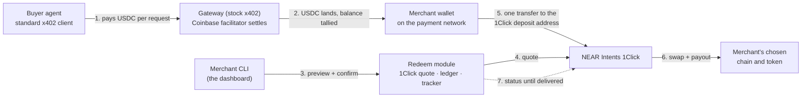

# 1CS Redeem Demo

Demo of a "redeem to any chain" payout feature for x402 payment gateways. Buyers pay stablecoins over standard x402 into the merchant's wallet on the payment network, exactly as such gateways work today; the merchant then redeems the accumulated balance to any chain and token supported by the NEAR Intents [1Click Swap API](https://docs.near-intents.org/), with one transfer signed from their own wallet and no custody in between. The repo contains a stand-in x402 gateway (stock middleware plus a balance tally), a buyer script, the redeem module (quote, payment instructions, swap tracking, ledger) and a merchant CLI that plays the dashboard. Mainnet only, cent-sized amounts.

## How it works



Two processes (`gateway` on :4021, `module` on :4022) and two scripts (`buy`, `redeem`). The gateway is unmodified x402 apart from a ten-line balance tally; everything 1Click-specific lives in the module.

## Components

**Stand-ins, only for the demo** (they exist in the real world already, or would be built by the gateway operator):

| Component | File | Stands in for |
|---|---|---|
| Buyer agent | `scripts/buyer.ts` | Any x402-paying client or AI agent; a stock `@x402/fetch` client with a funded wallet. |
| Gateway | `src/gateway.ts` | The operator's x402 gateway: stock middleware plus the Coinbase facilitator, paying into the merchant wallet exactly as today. |
| Balance tally | `src/gateway.ts` → `balances.json` | The gateway's own settlement bookkeeping, which knows how much each merchant can redeem. |
| Merchant CLI | `scripts/redeem.ts` | Two things at once: the dashboard's Redeem screen (balance, preview, confirm, history) and the merchant's wallet signing the transfer. |

**New for this service** (what would ship to production, in some form):

| Component | File | What it does |
|---|---|---|
| Redeem module | `src/module.ts`, `src/redeem.ts` | The HTTP service the gateway's dashboard backend calls: preview and confirm a redeem (1Click quotes), take the merchant's tx hash, track the swap to delivery. |
| Ledger | `src/ledger.ts` | One record per redeem, from instructions to delivery or refund; a JSON file here, a database table in production. |
| Network table | `src/networks.ts` | The payment networks a merchant can redeem from, their USDC contracts and 1Click asset ids, plus destination aliases. |
| Dashboard and API changes | not in this repo | The operator's side: a Redeem screen and public-API endpoints proxying the four module calls, wallet-connect or a custody signer for the transfer, and balance decrement/restore on confirm, expiry and refund. |

## Before you start

Everything below is needed only once. Fill the values into `.env` (copy `.env.example`).

| What | Where | Notes |
|---|---|---|
| Coinbase Developer Platform **Secret** API key | portal.cdp.coinbase.com → API keys → Secret | Facilitator verify/settle on mainnet. Free tier: 1,000 settlements/month. |
| 1Click partner JWT (optional) | partners.near-intents.org | Removes the 0.2 % fee on quotes. Everything works without it. |
| Buyer wallet | fresh EOA | ~3 USDC on each network below. No gas needed. |
| Merchant wallet | fresh EOA | A few cents of gas per network (ETH on Base and Arbitrum, POL on Polygon). No USDC; it receives the payments. |
| Seller destination | a NEAR account (and optionally a Tron address) | Where redeems are delivered. |

Native USDC contracts for funding the buyer (not the bridged `USDC.e` variants):

| Network | USDC |
|---|---|
| Base `eip155:8453` | `0x833589fCD6eDb6E08f4c7C32D4f71b54bdA02913` |
| Polygon `eip155:137` | `0x3c499c542cEF5E3811e1192ce70d8cC03d5c3359` |
| Arbitrum `eip155:42161` | `0xaf88d065e77c8cC2239327C5EDb3A432268e5831` |

Then:

```bash
npm install
cp .env.example .env
npm run gateway      # :4021
npm run module       # :4022
npm run buy -- --network eip155:42161 --times 5
npm run redeem -- --network eip155:42161 --to near-usdc --recipient <account.near> --dry   # balance + preview
npm run redeem -- --network eip155:42161 --to near-usdc --recipient <account.near>         # full redeem
npm run redeem -- --list                                                                   # history
```

`--amount <units>` redeems part of the balance, `--delay 90` sends late on purpose to show the refund path, `--yes` skips the confirmation prompt.

Route minimums per redeem: 0.15 USDC from Base and 0.10 from Arbitrum to USDC on NEAR; about 2 USDC to USDT on Tron. Minimums move; a `--dry` preview prints the current one when the amount is too low. Polygon is configured but currently rejected by 1Click with a temporary $1,000 minimum.
